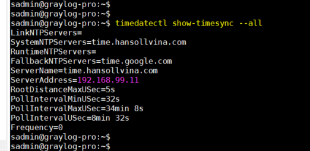

# Cách chỉnh giờ

## - Kiểm tra giờ hiện tại

```bash
date
timedatectl
```

## - Chỉnh giờ bằng tay

```bash
# cài giờ bằng tay
sudo timedatectl set-time "2026-06-26 14:00:00"

# chỉnh múi giờ
sudo timedatectl set-timezone Asia/Ho_Chi_Minh
```

## - Chỉnh giờ thông qua NTP Server

```bash
sudo nano /etc/systemd/timesyncd.conf

```

- Chỉnh lại là:

    ```bash
    [Time]
    NTP=time.hansollvina.com
    FallbackNTP=time.google.com
    ```
## - Restart NTP client

```bash
sudo systemctl restart systemd-timesyncd
```

## - Kiểm tra sync

```bash
timedatectl show-timesync --all
```

