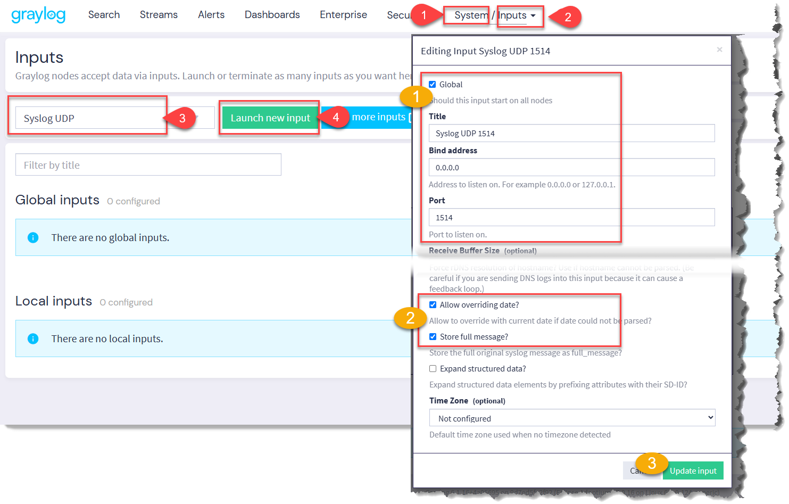
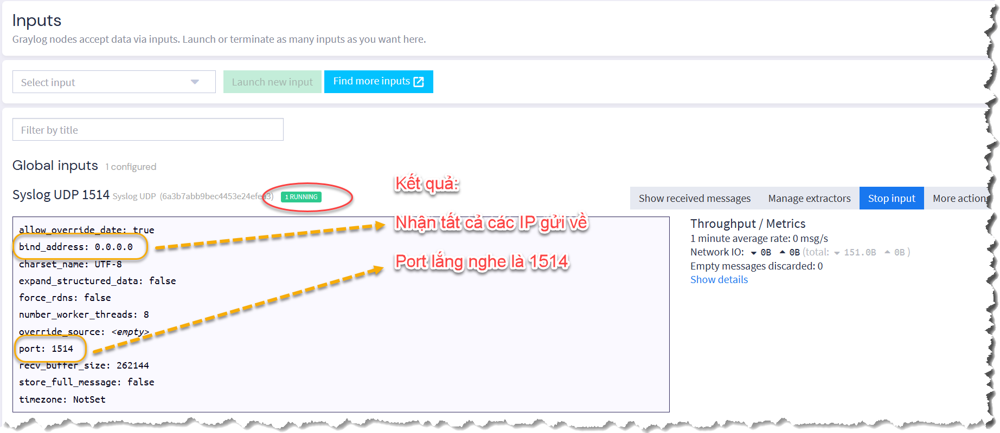
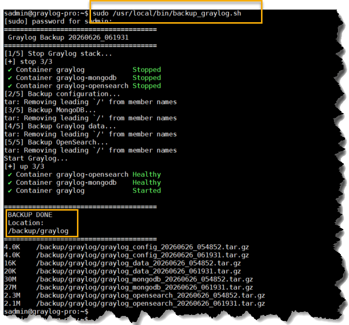
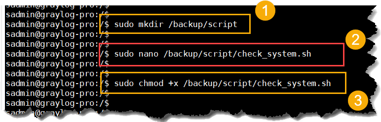
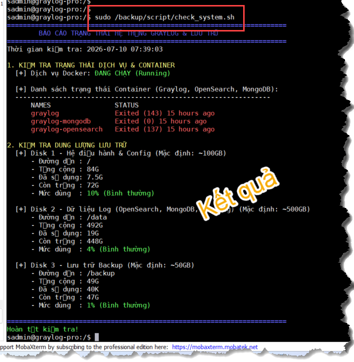
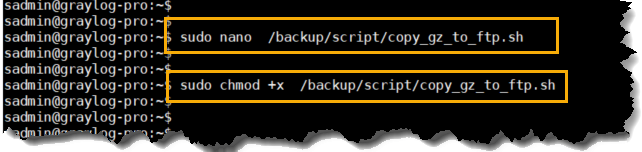

# CẤU HÌNH CĂN BẢN

## 1. Trên Graylog

- Cấu hình Syslog lắng nghe tất cả các thiết bị gửi về, lắng nghe trên **port 1514** (vì trong trong docker cấu hình 1514)



- Kết quả



## 2. Backup cấu hình Graylog

### 2.1 Mục tiêu:

- Cấu hình triển khai
- Database Graylog (MongoDB)
- Dữ liệu log/index (OpenSearch)
- Journal Graylog
- Backup archive vào đưa vào **/backup/graylog**
- Lập lịch backup hàng ngày

### 2.2 Thực hiện:

#### - Tạo file `/usr/local/bin/backup_graylog.sh` có nội dung:

    ```bash
    sudo nano /usr/local/bin/backup_graylog.sh
    ```
    - Nội dung file:

    ```bash
    #!/bin/bash
    #/usr/local/bin/backup_graylog.sh

    set -e

    # ==============================
    # Graylog Backup Script
    # ==============================

    BACKUP_DIR="/backup/graylog"
    DATE=$(date +%Y%m%d_%H%M%S)

    INSTALL_DIR="/opt/graylog-stack"

    GRAYLOG_DATA="/data/graylog"
    MONGO_DATA="/data/mongodb"
    OPENSEARCH_DATA="/data/opensearch"


    echo "======================================"
    echo " Graylog Backup $DATE"
    echo "======================================"


    mkdir -p ${BACKUP_DIR}


    echo "[1/5] Stop Graylog stack..."

    cd ${INSTALL_DIR}

    docker compose stop


    echo "[2/5] Backup configuration..."

    tar czf \
    ${BACKUP_DIR}/graylog_config_${DATE}.tar.gz \
    ${INSTALL_DIR}


    echo "[3/5] Backup MongoDB..."

    tar czf \
    ${BACKUP_DIR}/graylog_mongodb_${DATE}.tar.gz \
    ${MONGO_DATA}


    echo "[4/5] Backup Graylog data..."

    tar czf \
    ${BACKUP_DIR}/graylog_data_${DATE}.tar.gz \
    ${GRAYLOG_DATA}


    echo "[5/5] Backup OpenSearch..."

    tar czf \
    ${BACKUP_DIR}/graylog_opensearch_${DATE}.tar.gz \
    ${OPENSEARCH_DATA}


    echo "Start Graylog..."

    docker compose up -d


    echo ""
    echo "======================================"
    echo " BACKUP DONE"
    echo " Location:"
    echo " ${BACKUP_DIR}"
    echo "======================================"

    du -sh ${BACKUP_DIR}/*
    ```

> Lưu file:
>  - Ctrl + O -> Enter
>  - Ctrl + X

#### - Cấp quyền cho file:

```bash
sudo chmod +x /usr/local/bin/backup_graylog.sh
```

#### - Test backup

```bash
sudo /usr/local/bin/backup_graylog.sh
```

- Kết quả có dạng



#### - Lập lịch backup mỗi ngày
> Nếu sai giờ cần chỉnh lại, [Cánh chỉnh giờ Ubuntu](Cach_chinh_gio_ubuntu.md)
- Tạo cron:

```bash
sudo crontab -e
```

- Thêm dòng vào cuối và lưu file

```bash
# chạy backup lúc 20 giờ 30 mỗi ngày
30 20 * * * /usr/local/bin/backup_graylog.sh >> /var/log/graylog_backup.log 2>&1
```
>   Giải thích:
>   - 30   = phút 30
>   - 20   = giờ 20
>   - *    = mỗi ngày
>   - *    = mỗi tháng
>   - *    = mọi thứ

- Kiểm tra đã lưu

```bash
sudo crontab -l
```

- Kích hoạt cron

```bash
sudo systemctl enable cron
sudo systemctl start cron
```
- Test cron

```bash
systemctl status cron
```

- Xem log backup

```bash
tail -f /var/log/graylog_backup.log
```

## 3. Kiểm tra trạng thái Graylog và Lưu trữ

### 3.1 Tạo thư mục lưu trữ có tên script

```bash
sudo mkdir /backup/script
```

### 3.2 Soạn nội dung file `check_system.sh`


```bash
sudo nano /backup/script/check_system.sh
```

#### Nội dung file `check_system.sh`

```bash
#!/bin/bash

# ==============================================================================
# Script kiem tra suc khoe he thong Graylog va Dung luong phan vung
# ==============================================================================

# Dinh nghia mau sac cho de nhin (chi dung khi in ra man hinh)
RED='\033[0;31m'
GREEN='\033[0;32m'
YELLOW='\033[1;33m'
BLUE='\033[0;34m'
NC='\033[0m' # Khong mau

# ---------------------------------------------------------
# CAU HINH LOG
# ---------------------------------------------------------
LOG_DIR="/backup/script/logs"
mkdir -p "$LOG_DIR"

# Ten file log = thoi gian bat dau kiem tra
LOG_FILE="$LOG_DIR/check_system_$(date +%Y%m%d_%H%M%S).log"

# Ham log: in ra man hinh (co mau) va ghi vao file log (bo ma mau, kem timestamp)
log() {
    local msg="$1"
    local ts
    ts=$(date '+%Y-%m-%d %H:%M:%S')

    # In ra man hinh nguyen ban (giu mau)
    echo -e "$msg"

    # Ghi vao file log: loai bo ma mau ANSI truoc khi ghi
    local plain_msg
    plain_msg=$(echo -e "$msg" | sed -r 's/\x1B\[[0-9;]*[mK]//g')
    echo "[$ts] $plain_msg" >> "$LOG_FILE"
}

log "${BLUE}======================================================================${NC}"
log "${BLUE}        BAO CAO TRANG THAI HE THONG GRAYLOG & LUU TRU ${NC}"
log "${BLUE}======================================================================${NC}"
log "Thoi gian kiem tra: $(date '+%Y-%m-%d %H:%M:%S')"
log ""

# ---------------------------------------------------------
# 1. KIEM TRA SUC KHOE DOCKER VA CAC CONTAINER
# ---------------------------------------------------------
log "${YELLOW}1. KIEM TRA TRANG THAI DICH VU & CONTAINER${NC}"

# Kiem tra Docker Engine
if systemctl is-active --quiet docker; then
    log "  [+] Dich vu Docker: ${GREEN}DANG CHAY (Running)${NC}"
else
    log "  [+] Dich vu Docker: ${RED}DA DUNG (Stopped/Failed)${NC} - Hay kiem tra lai Docker Engine!"
fi

# Kiem tra cac Container lien quan den he thong Graylog
log ""
log "  [+] Danh sach trang thai Container (Graylog, OpenSearch, MongoDB):"
log "  ----------------------------------------------------------------"

# Loc ra cac container co ten chua graylog, opensearch, mongo
CONTAINERS=$(docker ps -a --format "table {{.Names}}\t{{.Status}}" | grep -iE "graylog|opensearch|mongo|elastic|NAME")

if [ -z "$CONTAINERS" ]; then
    log "  ${RED}Khong tim thay container nao lien quan den Graylog dang chay!${NC}"
else
    # In ra danh sach va boi mau trang thai, dong thoi ghi log
    echo "$CONTAINERS" | while read -r line; do
        if echo "$line" | grep -qi "Up"; then
            log "      ${GREEN}$line${NC}"
        elif echo "$line" | grep -qi "Exited"; then
            log "      ${RED}$line${NC}"
        else
            log "      $line"
        fi
    done
fi
log ""

# ---------------------------------------------------------
# 2. KIEM TRA DUNG LUONG O CUNG (Disk 1, 2, 3)
# ---------------------------------------------------------
log "${YELLOW}2. KIEM TRA DUNG LUONG LUU TRU${NC}"

# Ham kiem tra dung luong o cung
check_disk() {
    local label=$1
    local path=$2
    local expected_size=$3

    if [ -d "$path" ]; then
        # Lay thong so tu lenh df -h
        local total avail used pcent
        total=$(df -h "$path" | tail -n 1 | awk '{print $2}')
        used=$(df -h "$path" | tail -n 1 | awk '{print $3}')
        avail=$(df -h "$path" | tail -n 1 | awk '{print $4}')
        pcent=$(df -h "$path" | tail -n 1 | awk '{print $5}' | tr -d '%')

        log "  [+] ${label} (Mac dinh: ~${expected_size})"
        log "      - Duong dan : $path"
        log "      - Tong cong : $total"
        log "      - Da su dung: $used"
        log "      - Con trong : $avail"

        # Canh bao neu dung luong vuot qua 85%
        if [ "$pcent" -ge 85 ]; then
            log "      - Muc dung  : ${RED}$pcent% (CANH BAO: Sap day!)${NC}"
        else
            log "      - Muc dung  : ${GREEN}$pcent% (Binh thuong)${NC}"
        fi
    else
        log "  [+] ${label}"
        log "      ${RED}Khong tim thay thu muc/phan vung mounted tai: $path${NC}"
    fi
    log ""
}

# Disk 1: Phan vung he dieu hanh (/)
check_disk "Disk 1 - He dieu hanh & Config" "/" "100GB"

# Disk 2: Phan vung du lieu (/data)
check_disk "Disk 2 - Du lieu Log (OpenSearch, MongoDB, Graylog)" "/data" "500GB"

# Disk 3: Phan vung Backup (/backup)
check_disk "Disk 3 - Luu tru Backup" "/backup" "50GB"

log "${BLUE}======================================================================${NC}"
log "${GREEN}Hoan tat kiem tra!${NC}"
log "Chi tiet log duoc luu tai: $LOG_FILE"
```

### 3.3 Cấp quyền thực thi cho file check_system.sh


```bash
sudo chmod +x /backup/script/check_system.sh
```



### 3.4 Chạy file `check_system.sh`

```bash
sudo /backup/script/check_system.sh
```



## 4. Copy Backup lên FTP

### 4.1 Mục tiêu:

- Liệt kê các file `.gz `vào file `bk_list_file.txt`
- Script đọc file `bk_list_file.txt` và đẩy lên FTP
- Tự tìm hiểu các cài đặt FTP server

### 4.2 Thực hiện:

# Lấy tên file .gz đưa vào file .txt

- Liệt kê các file `.gz `

```bash
sudo find /backup/graylog/ -maxdepth 1 -type f -name "*.gz" -exec basename {} \; | sudo tee /backup/script/bk_list_file.txt > /dev/null
```

- Soạn file



```bash
sudo nano  /backup/script/copy_gz_to_ftp.sh
```

- Nội dung file Script

```bash
#!/bin/bash

# ==========================================
# CẤU HÌNH FTP SERVER
# ==========================================
FTP_SERVER=" địa chỉ ftp"
FTP_USER="ftp user"
FTP_PASS="ftp mat khau"
FTP_DIR="/01.devices/Graylog/" # Thư mục đích trên FTP (bắt buộc có dấu / ở cuối)

# Thu muc chua cac file backup (.tar.gz...) can upload
SOURCE_DIR="/backup/graylog"

# Thu muc chua script va file danh sach
SCRIPT_DIR="/backup/script"
LIST_FILE="$SCRIPT_DIR/bk_list_file.txt"

# Thu muc luu file log
LOG_DIR="$SCRIPT_DIR/logs"
mkdir -p "$LOG_DIR"

# Ten file log = thoi gian bat dau chay backup
LOG_FILE="$LOG_DIR/backup_$(date +%Y%m%d_%H%M%S).log"

# Ham ghi log: vua in ra man hinh, vua ghi vao file log kem timestamp
log() {
    local msg="$1"
    local ts
    ts=$(date '+%Y-%m-%d %H:%M:%S')
    echo "$msg"
    echo "[$ts] $msg" >> "$LOG_FILE"
}

# ==========================================
# BAT DAU THUC THI
# ==========================================
if [ ! -f "$LIST_FILE" ]; then
    log "Loi: Khong tim thay file danh sach '$LIST_FILE'"
    exit 1
fi

log "Bat dau tien trinh upload len FTP..."
log "Nguon: $SOURCE_DIR -> Dich: ftp://$FTP_SERVER$FTP_DIR"

TOTAL=0
SUCCESS=0
FAILED=0

while IFS= read -r raw_filename || [ -n "$raw_filename" ]; do

    # Loai bo ky tu an \r (neu file text copy tu Windows sang) va khoang trang thua
    filename=$(echo "$raw_filename" | tr -d '\r' | xargs)
    if [ -z "$filename" ]; then
        continue
    fi

    TOTAL=$((TOTAL + 1))

    # File backup nam trong SOURCE_DIR
    FILE_PATH="$SOURCE_DIR/$filename"
    if [ ! -f "$FILE_PATH" ]; then
        log "Canh bao: File '$FILE_PATH' khong ton tai tren he thong. Bo qua!"
        FAILED=$((FAILED + 1))
        continue
    fi

    log "Dang upload: $filename -> ftp://$FTP_SERVER$FTP_DIR$filename"

    curl -s -T "$FILE_PATH" "ftp://$FTP_USER:$FTP_PASS@$FTP_SERVER$FTP_DIR"

    if [ $? -eq 0 ]; then
        log "Upload thanh cong: $filename -> $FTP_DIR$filename"
        SUCCESS=$((SUCCESS + 1))
    else
        log "Loi khi upload: $filename"
        FAILED=$((FAILED + 1))
    fi

done < "$LIST_FILE"

log "Hoan thanh tien trinh! Tong: $TOTAL | Thanh cong: $SUCCESS | That bai: $FAILED"
log "Chi tiet log duoc luu tai: $LOG_FILE"
```

- Cấp quyền

```bash
sudo chmod +x  /backup/script/copy_gz_to_ftp.sh
```

> Ghi chú:
> - Nếu có nhiều file .sh muốn thực hiện thì tạo file .sh là liệt kê các file cần chạy vào để chúng thay theo thứ tự mong muốn
> - Ví dụ:
```bash
#!/bin/bash

echo "=== Bắt đầu chạy chuỗi script ==="

# Chạy lần lượt từng file
/đường/dẫn/đến/script1.sh
/đường/dẫn/đến/script2.sh
/đường/dẫn/đến/script3.sh

echo "=== Hoàn thành tất cả script ==="
```

## 5. Cấu Hình Thiết Bị Gửi Log

[Tại đây - II. Log Source](<../../II. Log Source (Sender)>)


