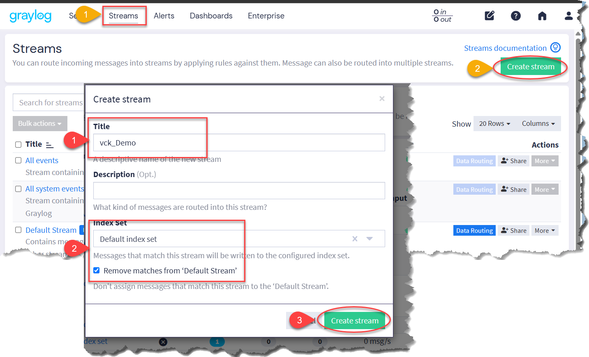
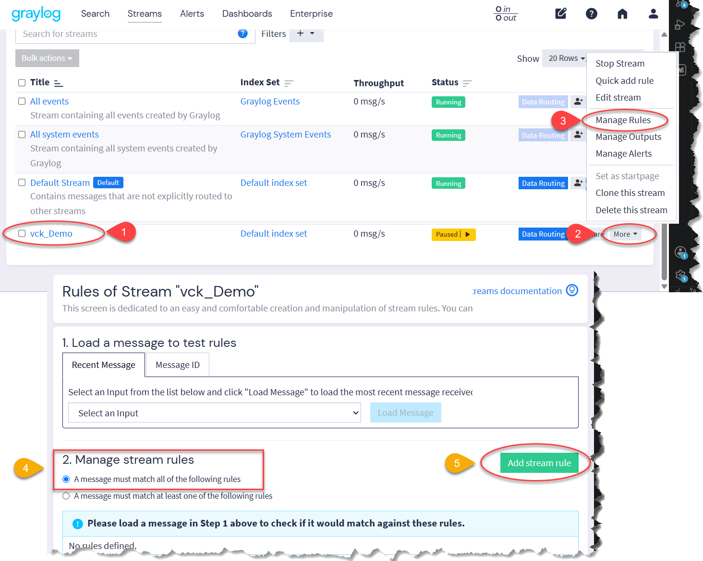
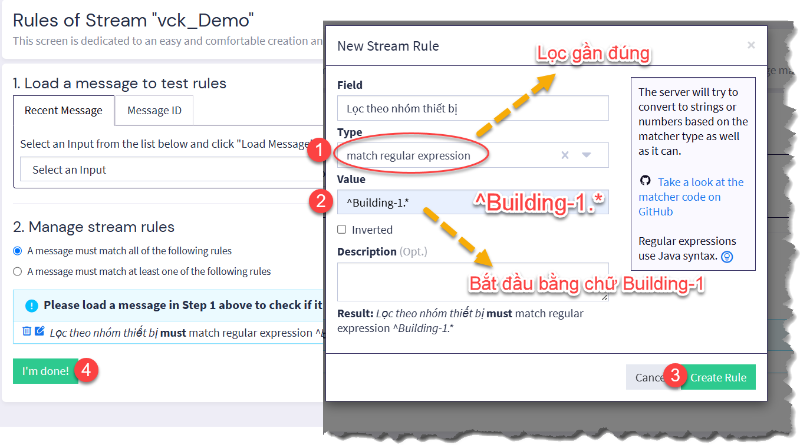
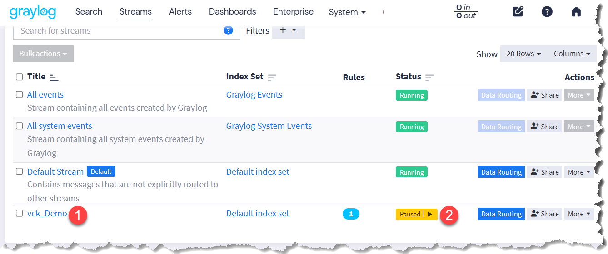
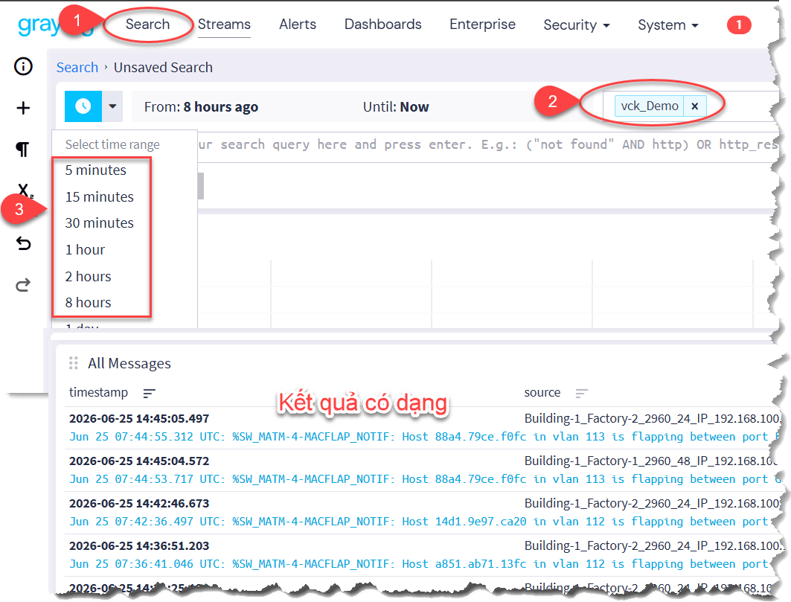

# STREAMS

## - TẠO STREAMS TRÊN GRAYLOG

### 1. Mục đích:
- Phân nhóm thiết bị dựa vào các ký tự đầu source gửi về
- Trong ví dụ là lọc nhóm thiết bị có tên bắt đầu bằng chữ **Building1**
- Không lọc log mà hiển thị 100% log nhận được

> Chú ý:
> - Dựa vào `logging origin-id` **hostname**
> - HOẶC `logging origin-id string` **<do chúng ta định nghĩa>**

### 2. Thực hiện:

- Tạo Streams

- Tạo Rule

- Thêm điểu kiện lọc

- Nhấn chữ Paused để chuyển trạng thái sang Running

- Thực hiện lọc

