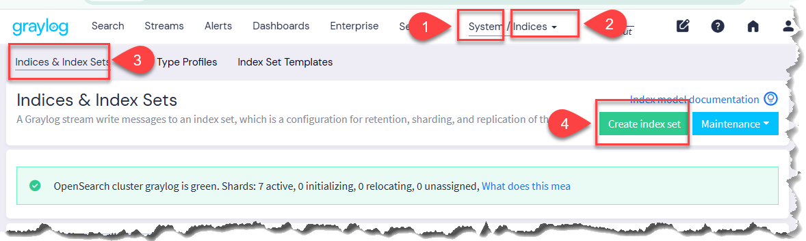
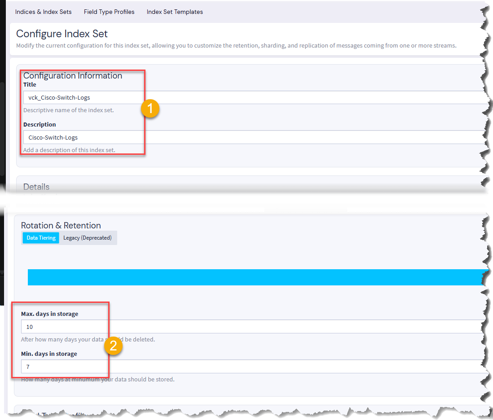
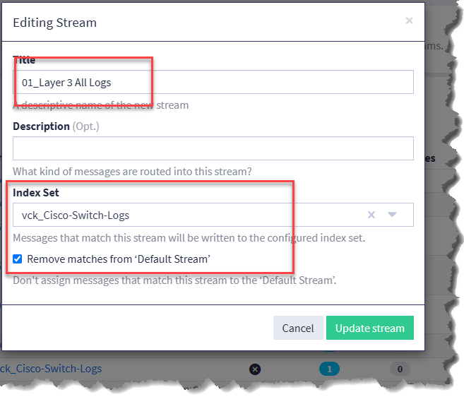
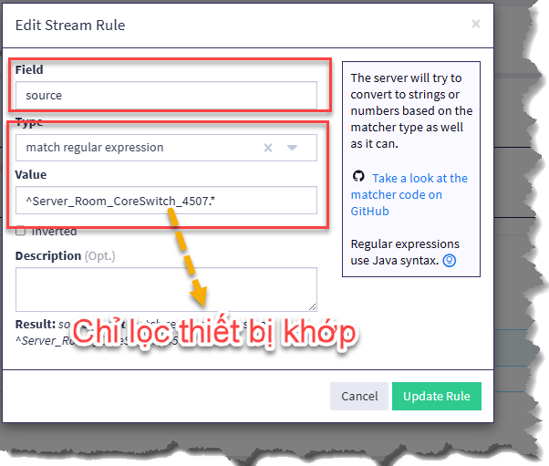
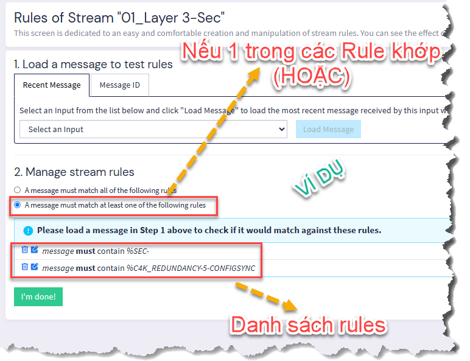
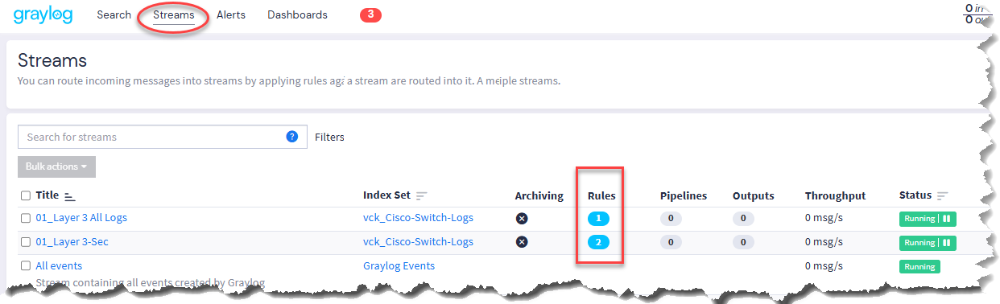

# TẠO STEAM CHO THIẾT BỊ CORE

## 1. Ý Tưởng:

- Không gom quá nhiều Event/Filter thành 1 stream, sau này dashboard và alert sẽ khó.
- NÊN tách thành nhiều Stream nhỏ để tiện soi log
- Tạo Indies Set giới hạng thời gian lưu log

- Ví dụ:

| Loại              | Stream             |
| ----------------- | ------------------ |
| Interface up/down | Cisco-L3-Interface |
| ACL               | Cisco-L3-ACL       |
| Config change     | Cisco-L3-Config    |
| HSRP              | Cisco-L3-HA        |
| OSPF/BGP          | Cisco-L3-Routing   |

Hay Stream cho `Cisco-L3-Security` gồm:
- ACL deny
- login fail
- port-security
- IP access-list

## 2. Mục tiêu:

- Định nghĩa Index Set có tên `vck_Cisco-Switch-Logs` để giới hạng thời gian lưu trữ log trên Server
- Tạo mới Stream `01_Layer 3 All Logs` gán vào Index Set `vck_Cisco-Switch-Logs`
- Tạo Stream `01_Layer 3-Sec` với nhiều Rule

## 3. Thực hiện:

### 3.1 Index Set

### 3.2 Tạo Stream, gán Index Set và tạo Rule

- Tạo Rule: chỉ lọc ^Server_Room_CoreSwitch_4507.*

- Tương tự cho các rule khác

- Nếu nhiều rule trong 1 Stream NÊN CHỌN **A message must match at least one of the following rules** tức là điều kiện `HOẶC` để khớp 1 trong các rule

- Vào Streams sẽ thấy số lượng rule đã tạo cho mỗi Stream

