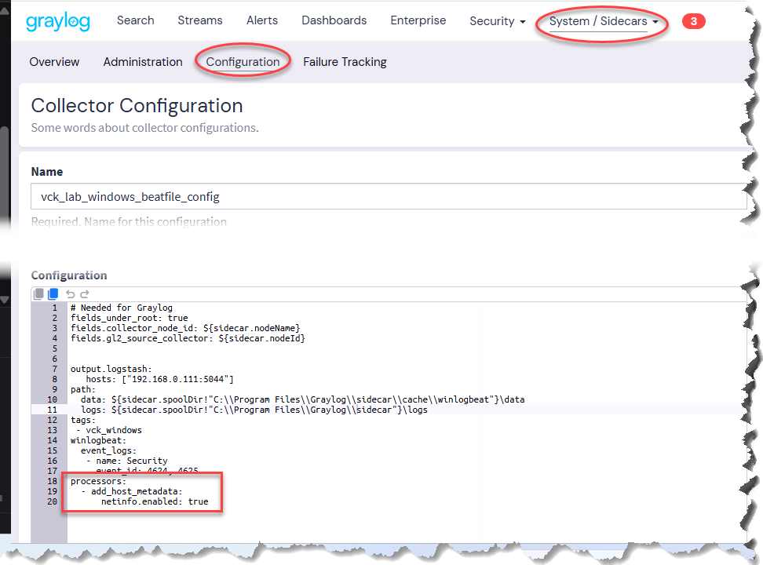
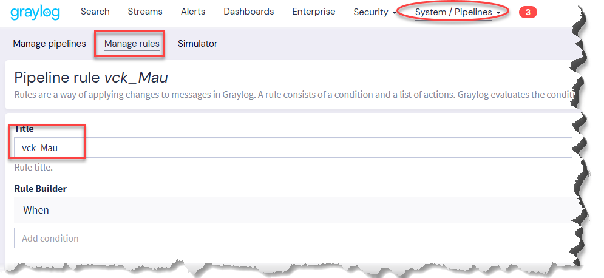
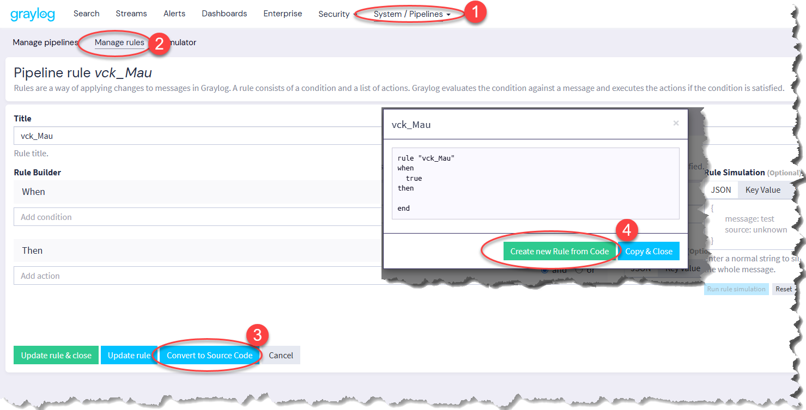
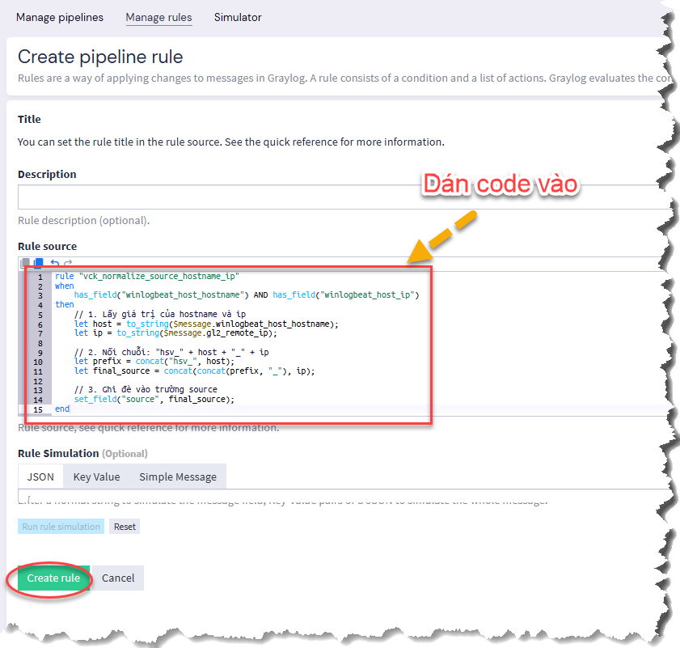
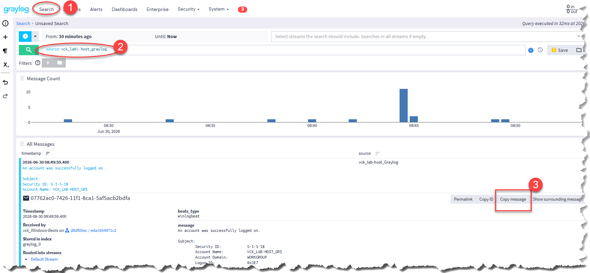
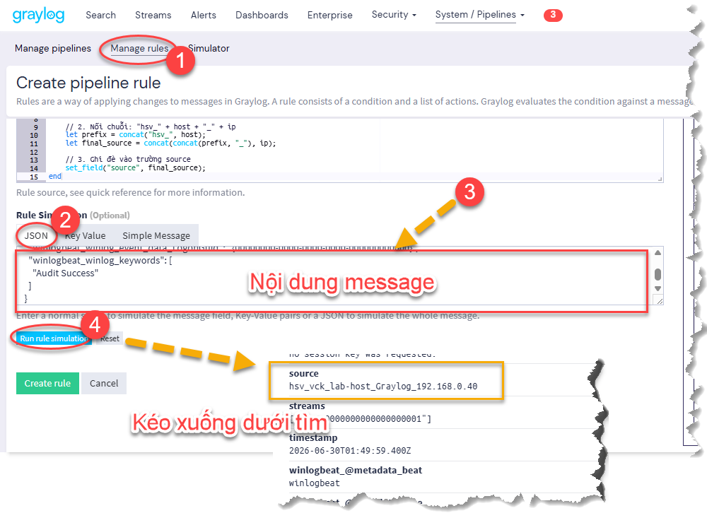
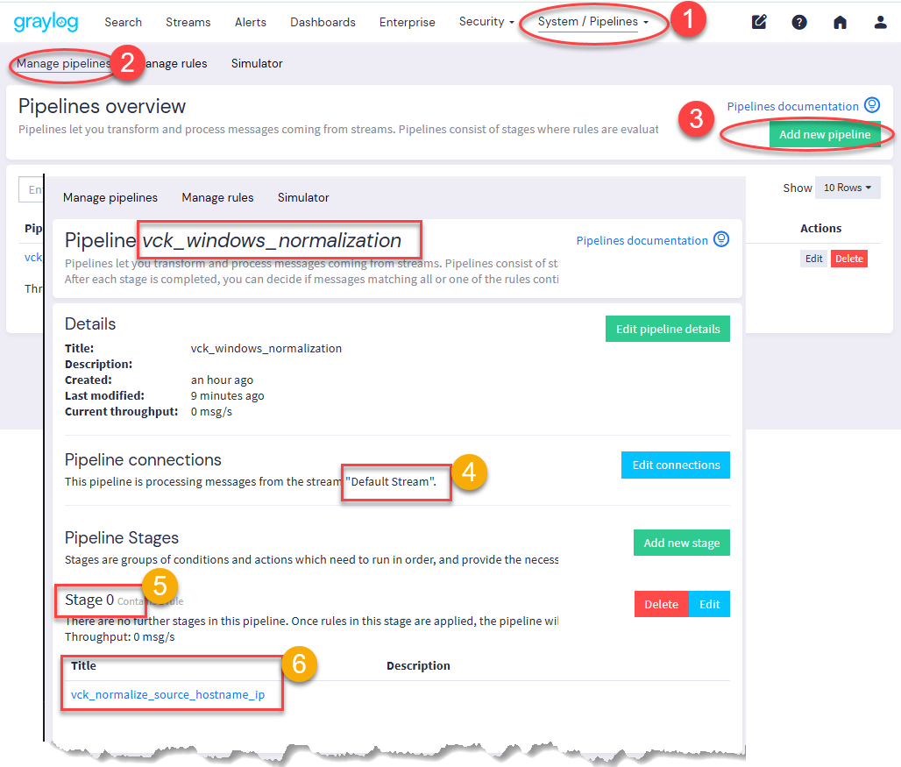
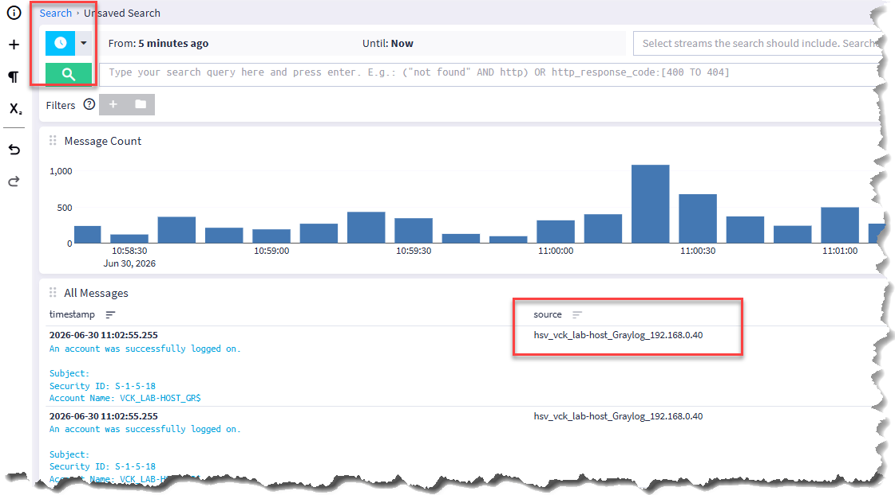

# CHUẨN HÓA SOURCE

## 1. Mục tiêu:

- Thực hiện trên Windows với Winlogbeat
- Log đẩy về Graylog Server **source** là hostname(tên máy tính), ví dụ: `vck_lab-host_Graylog`
- Dựa vào các trường đã có như: winlogbeat_host_hostname, winlogbeat_host_ip, winlogbeat_host_mac, gl2_remote_ip để chuyển source mới **có dạng**: `hsv_ten-may-tinh_dia-chi-ip-may-tinh`. Ví dụ: **hsv_vck_lab-host_Graylog_192.168.0.40**

## 2. Thực hiện:

### 2.1 Cài Graylog Sidecar

(Tham khảo các cài trên Windows)

### 2.2 Pipeline:

#### Bước 1. Stop Services Graylog Sidecar

*(thực hiện trên windows/sender)*

#### Bước 2. Sữa nội dung Collector Configuration
System -> Sidecars -> Configuration -> chọn Beatfile config cần chỉnh -> thêm code dưới vào cuối

```YAML
processors:
  - add_host_metadata:
      netinfo.enabled: true 
```


#### Bước 3. Start Services Graylog Sidecar

*(thực hiện trên windows/sender)*

#### Bước 4. Tạo rule Pipeline

- Tạo pipeline trống: 

System -> Pipelines -> Manage rules -> Create Rule -> Ví dụ: vck_Mau



- Convert to Source Code

Edit Pipeline mẫu (vck_Mau) -> Convert to Source Code -> Creat New Rule from Code -> dán code vào *(nội dung trong file pipeline code-mau.txt)* -> Create Rule






#### Bước 5. Test Rule vừa tạo

- Copy message 



- Chạy Rule Simulation xem Source như ý chưa



#### Bước 6: Map Rule Pipeline

```bash
System
 -> Pipelines
 -> Manage pipelines
 -> Create pipeline
 -> Đặt tên <vck_windows_normalization>
 -> Pipeline connections -> (chọn Default Stream)
 -> Stage 0 -> chọn (Rule bước trên) vck_normalize_source_hostname_ip
```



#### Bước 7: Xem kết quả Pipeline

