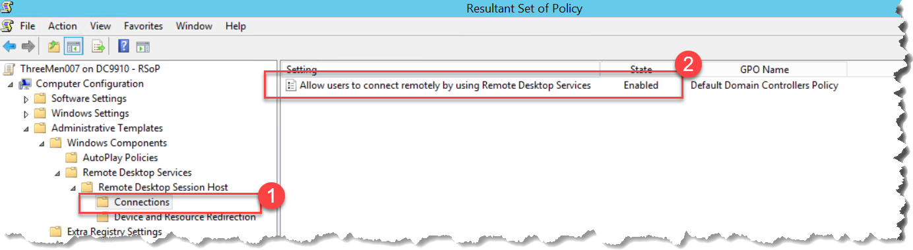
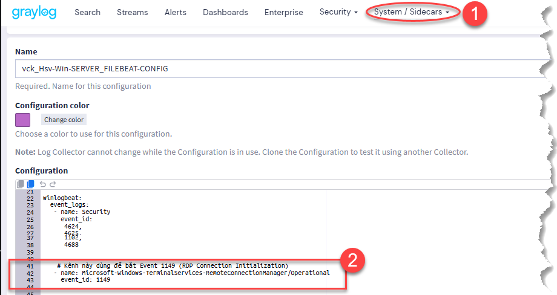
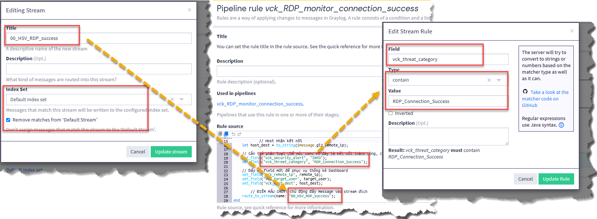
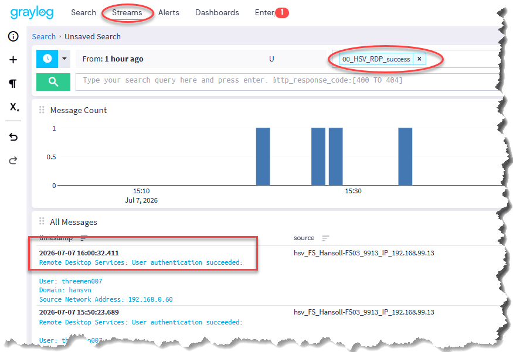

# PIPELINE ROUTE_TO_STREAM

- **Vấn đề**: Dữ liệu đã qua Pipeline hiển thị trên Dashboard nhưng không có trong Stream.
- **Nguyên nhân**: Thứ tự xử lý mặc định của hệ thống là `Stream Rules -> Pipelines`.
- **Giải pháp**: Bỏ qua Stream Rule mặc định và sử dụng hàm **route_to_stream()** bên trong Pipeline rule *(định tuyến thủ công)* để chủ động định tuyến (route) message vào Stream mong muốn.

    - Code mẫu
    ```bash
    rule "Tên Rule"
    when
        ...
    then
        ...
        route_to_stream(name: "Tên Stream cần đẩy định tuyến vào");
    end
    ```
 
## I. MỤC TIÊU

### 1.1 Tổng quan:

#### 1.1.1 Monitor RDP thành công.
#### 1.1.2. Trích xuất thông tin cần thiết: `ip nguồn`, `ip đích`, `user đăng nhập`
#### 1.1.3. Gắn nhãn phân loại: `cảnh cáo`, `gán nhãn kết nối thành công`
#### 1.1.4. Tạo Stream để theo dõi/lọc.
#### 1.1.5. Định tuyến log bằng `route_to_stream()` để tránh bỏ sót.

### 1.2 Mô tả chi tiết

#### 1. Monitor RDP thành công

Giám sát các phiên **Remote Desktop Protocol (RDP)** đăng nhập thành công thông qua **Event ID 1149** trên kênh:

- `Microsoft-Windows-TerminalServices-RemoteConnectionManager/Operational`

Sự kiện này được xem là dấu hiệu một yêu cầu kết nối RDP đã được xác thực thành công.

---

#### 2. Trích xuất thông tin kết nối

Khi phát hiện sự kiện, Pipeline sẽ trích xuất và chuẩn hóa các trường dữ liệu sau:

| Field nguồn | Field chuẩn hóa | Ý nghĩa |
|--------------|-----------------|----------|
| `winlogbeat_winlog_user_data_Param1` | `vck_target_user` | Tài khoản thực hiện kết nối |
| `winlogbeat_winlog_user_data_Param3` | `vck_remote_ip` | Địa chỉ IP nguồn của phiên RDP |
| `gl2_remote_ip` | `vck_host_dest` | Máy chủ/Host nhận kết nối |

---

#### 3. Gắn nhãn phân loại

Chuẩn hóa log nhằm phục vụ việc tìm kiếm, thống kê và xây dựng Dashboard.

| Field | Giá trị |
|-------|----------|
| `vck_security_alert` | `INFO` |
| `vck_threat_category` | `RDP_Connection_Success` |

---

#### 4. Tạo Stream theo dõi

Tạo Stream:

```text
00_HSV_RDP_success
```

##### Mục đích

- Hiển thị tập trung toàn bộ các phiên RDP đăng nhập thành công.
- Hỗ trợ tìm kiếm và lọc nhanh các sự kiện.
- Là nguồn dữ liệu cho Dashboard, Report và Alert khi cần.
- Phân tách rõ với các Stream giám sát RDP thất bại hoặc các sự kiện bảo mật khác.

---

#### 5. Định tuyến log

Ở cuối Pipeline Rule, sử dụng:

```javascript
route_to_stream(name: "00_HSV_RDP_success");
```

##### Mục đích

- Chủ động chuyển log vào đúng Stream.
- Đảm bảo log luôn được phân loại chính xác.
- Tránh bỏ sót log do thứ tự xử lý mặc định của Graylog.
- Giúp Dashboard và Alert luôn nhận đầy đủ dữ liệu.

---

#### Kết quả mong đợi

Khi có một phiên RDP đăng nhập thành công:

- Hệ thống phát hiện **Event ID 1149**.
- Trích xuất **User**, **IP nguồn** và **Host/IP đích**.
- Gắn nhãn:
  - `INFO`
  - `RDP_Connection_Success`
- Tự động chuyển log vào Stream **`00_HSV_RDP_success`**.
- Log sẵn sàng cho việc **Search**, **Dashboard**, **Report** và **Alert**.


## II. THỰC HIỆN

- Tạo GPO, cho phép ghi log 1149-RDP thành công



- Cấu hình Sidecar, nhận Event ID 1149 *(có thể tham khảo file YAML trong code mẫu)*



- Tạo Stream



- Tạo Pipeline *(có thể tham khảo file cấu hình trong code mẫu)*

```bash
rule "vck_RDP_monitor_connection_success"
when
    // 1. Chỉ định đúng kênh của dịch vụ RDP
    has_field("winlogbeat_winlog_channel") AND
    to_string($message.winlogbeat_winlog_channel) == "Microsoft-Windows-TerminalServices-RemoteConnectionManager/Operational" AND
    
    // 2. Bắt đúng Event ID 1149
    has_field("winlogbeat_winlog_event_id") AND
    to_string($message.winlogbeat_winlog_event_id) == "1149"
then
    // Trích xuất trực tiếp từ các tham số có sẵn
    let target_user = to_string($message.winlogbeat_winlog_user_data_Param1);
    let remote_ip = to_string($message.winlogbeat_winlog_user_data_Param3);
    
            // Host nhận kết nối
    let host_dest = to_string($message.gl2_remote_ip);
    
    // Gắn thẻ phân loại (Để mức INFO vì đây là kết nối thành công, có thể là quản trị viên đang làm việc)
    set_field("vck_security_alert", "INFO");
    set_field("vck_threat_category", "RDP_Connection_Success");
    
    // Đẩy ra field mới để phục vụ thống kê Dashboard
    set_field("vck_remote_ip", remote_ip);
    set_field("vck_target_user", target_user);
    set_field("vck_host_dest", host_dest);
    
        // ĐIỂM MẤU CHỐT: chủ động đẩy message vào stream đích
    route_to_stream(name: "00_HSV_RDP_success");
end
```

- Test kết quả

