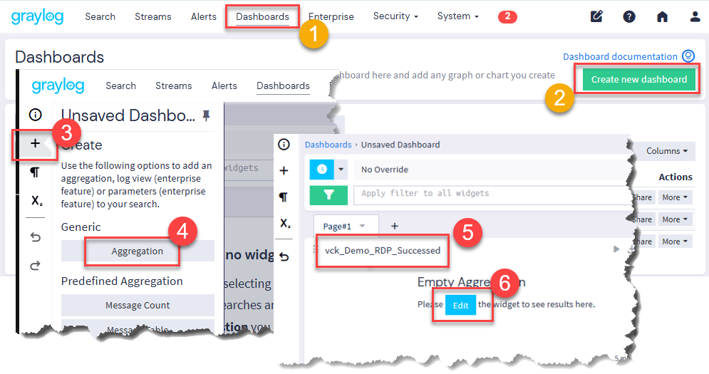
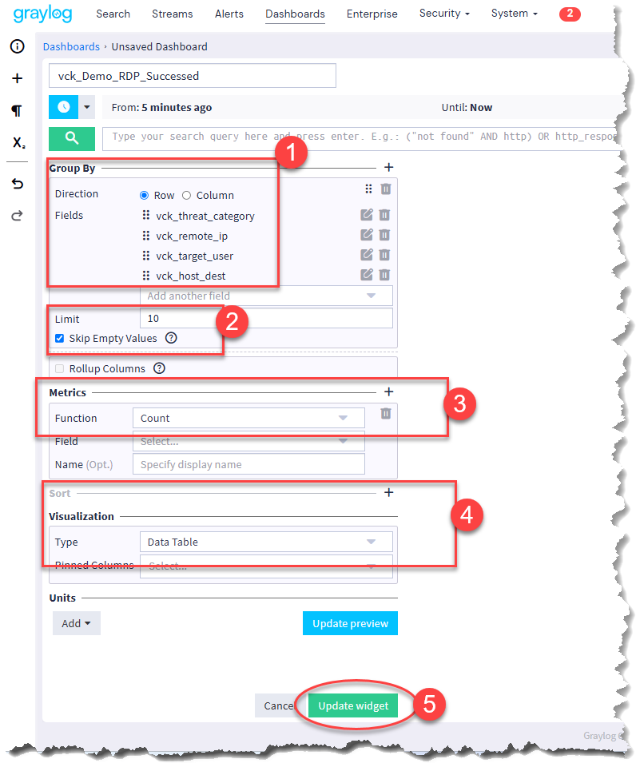
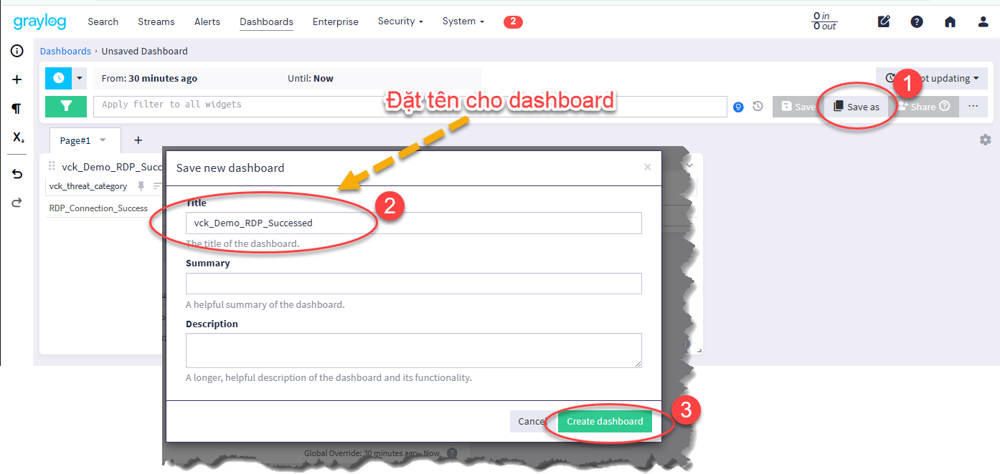
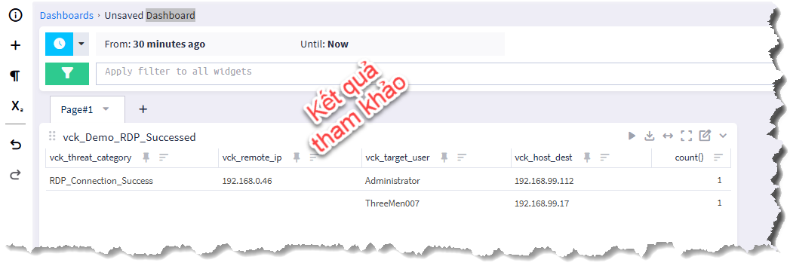

# BASHBOARD

## I. MỤC ĐÍCH

- Dựa vào trường (`vck_security_alert`, `vck_threat_category`, `vck_remote_ip`, `vck_target_user`, `vck_host_dest`) đã tạo ra trong phần Pipeline_route_to_stream_RDP

- Tạo Dashboard liệt kê 10 kết nối RDP thành công, xuất phát từ đâu đến đâu, dùng username nào kết nối

## II. THỰC HIỆN

- Tạo mới dashboard

- Cấu hình các trường theo yêu cầu

- Đặt tên cho dashboard

- Kết quả đạt được

> Chú ý: - Sau khi làm xong phải remote desktop thì mới thấy kết quả 

