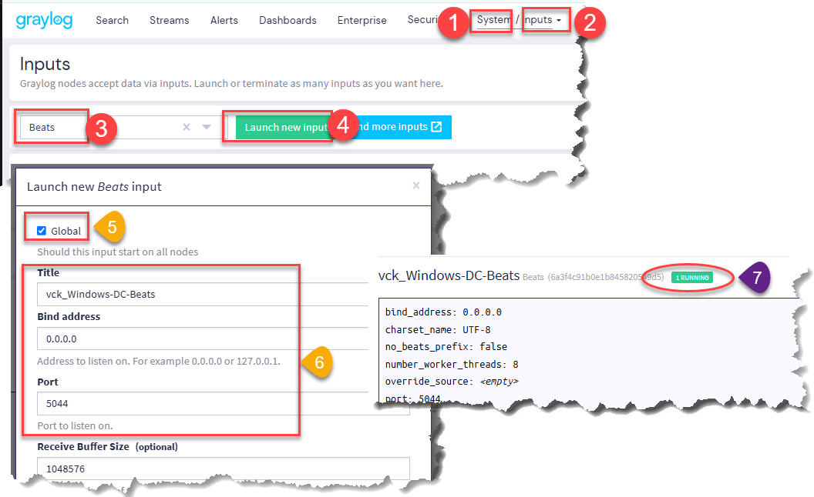
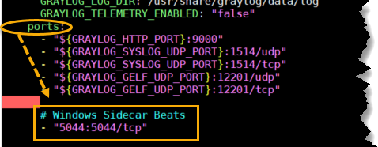
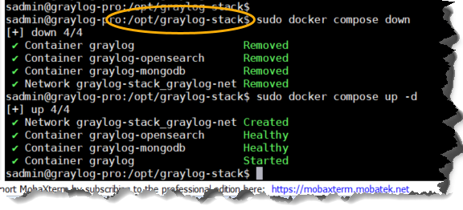
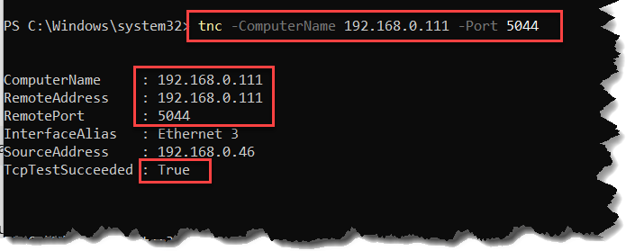
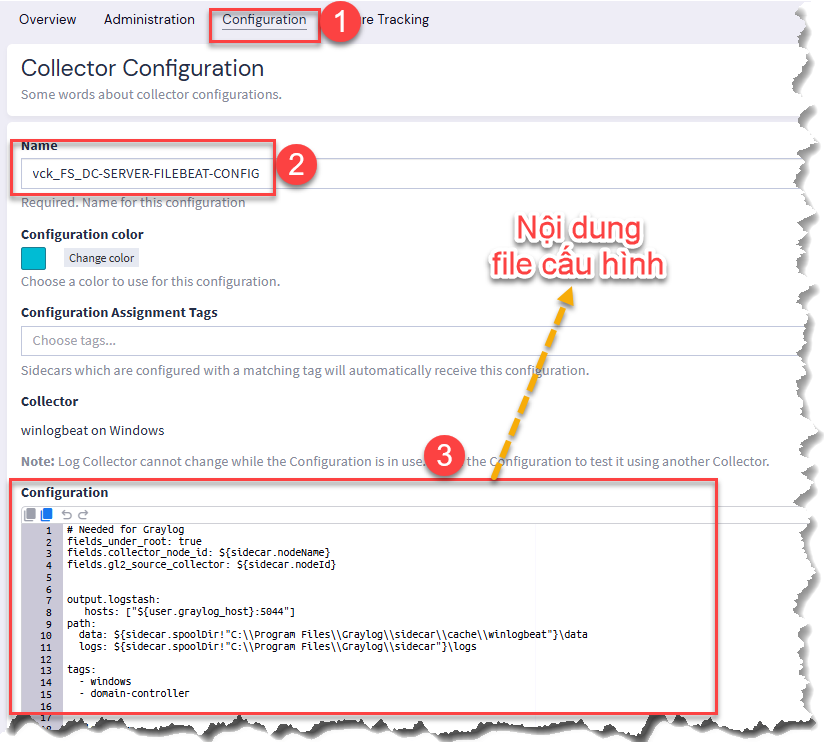
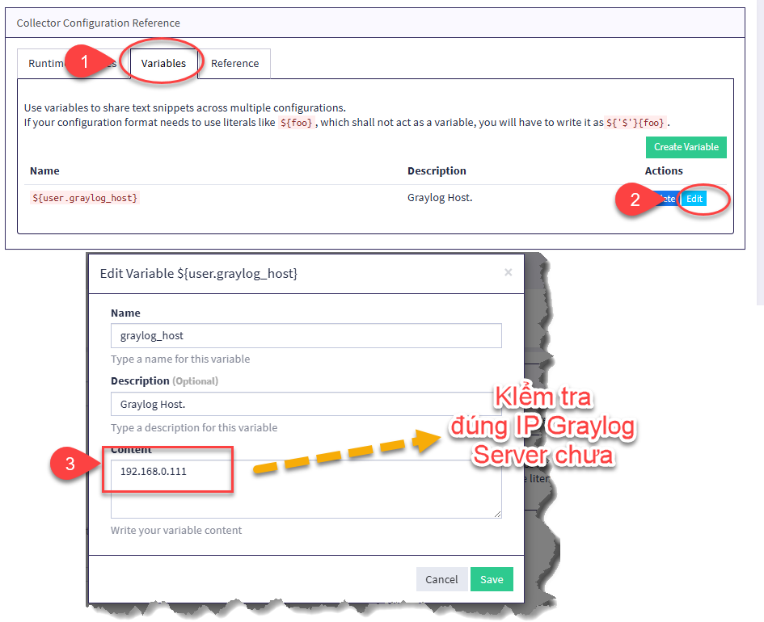
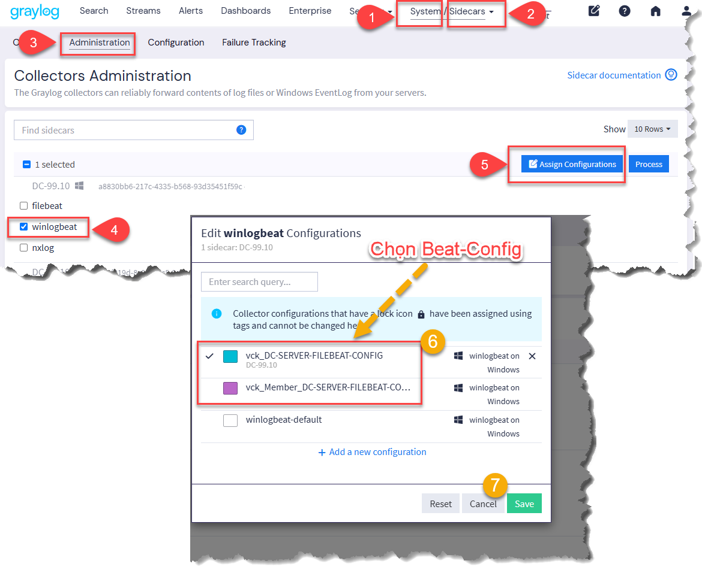

# GIÁM SÁT WINDOWS

- Thực hiện trên Graylog Server
- Chỉnh port allow port trên OS của graylog nếu cần
- Các Event phổ biến và ý nghĩa
    - Liên quan đến Remote Desktop

    | Event | Mục đích                  |
    | ----- | ------------------------- |
    | 4624  | Login thành công          |
    | 4625  | Login thất bại            |
    | 4634 / 4647    | Đăng xuất hoặc ngắt kết nối (Logoff) |
    | 4778  | Kết nối lại vào phiên RDP cũ (Session Reconnected)    |


    - Các Event phổ biến khác và ý nghĩa

| Event | Mục đích                  |
| ----- | ------------------------- |
| 4624  | Login thành công          |
| 4625  | Login thất bại            |
| 4672  | Admin privilege           |
| 4740  | Account bị lock           |
| 4720  | Tạo user                  |
| 4726  | Xóa user                  |
| 4732  | Thêm user vào local group |
| 4728  | Thêm vào domain group     |
| 4738  | User account changed      |
| 5136  | AD object modified        |
| 5140  | Network share access      |
| 1102  | Clear Security Log (dấu hiệu xóa log) |
| 4688  | Process Creation (chạy file/process)  |


## 1. Khởi tạo Input

```bash
System
 → Inputs
 → Select input
 → Beats
 → Launch new input

 → Đặt tên

 → Port: 5044
 → bind_address: 0.0.0.0
 ```
Đảm bảo input vừa tạo **RUNNING**.



## 1.1 Sửa docker-compose.yml

- Thêm dòng  `- "5044:5044/tcp"` vào file bên dưới ports:

```bash
cd /opt/graylog-stack

sudo nano docker-compose.yml
```


- Restart stack & kiểm tra 

```bash
sudo docker compose down
sudo docker compose up -d

sudo docker ps
```



### 1.2 Kiểm tra port 5044

```bash
tnc -ComputerName 192.168.0.111 -Port 5044
```



> Chú ý: 
> - Đảm bảo port 5044 phải được mở mới làm tiếp các bước khác

## 2. Generate API key

```bash
System
→ Sidecars
→ Configuration
→ Create or reuse a token for the graylog-sidecar user

→ Đặt tên → Copy
```
> Chú ý:
> - Lấy token này qua điền vào file sidecar.yml bên máy Sender

## 3. Tạo Collector Configuration



- Nội dung config tham khảo file `Sample-Config.YAML`

> Chú ý (Sample-Config.YAML):
> - Event ID trong file YAML là bộ lọc tối cao. Trên máy Windows có mở bao nhiêu log đi nữa thì cũng chỉ lưu cục bộ ở Event Viewer, còn Graylog chỉ nhận đúng những ID nào được list ra trong file cấu hình thôi.



- Quay qua Sender **khởi động lại Graylog Sider**

- Gán Beat-Config cho sender

```bash
System
→ Sidecars
→ Administration
→ Winlogbeat
→ Assign configurations 
→ Chọn Beat config thích hợp và -> Save
```



- Done! vào Search để xem

Token
- DC
13e6ga1r0ketbtjn7vdvsjt7ei6s4cv1gvg24bqohamfv2100q65


- vck_Hansoll-Server
1nsf7l0fka61us46c2jb8khrbm4jnd1m2ii1h1pqeubdlc29v1kf
