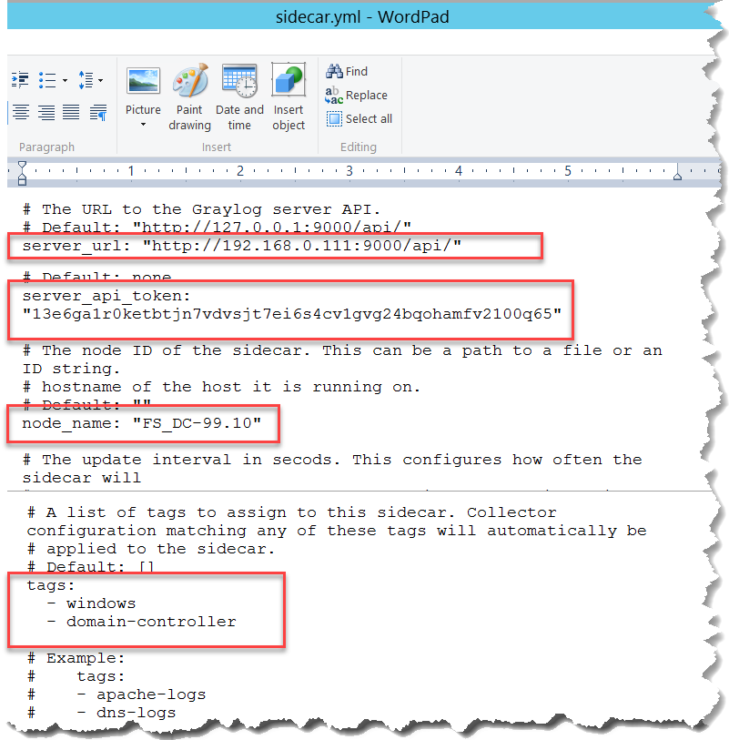
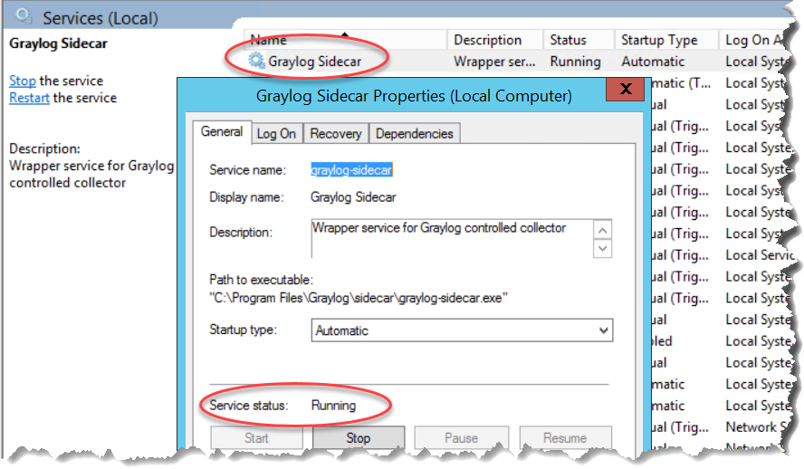

# GIÁM SÁT DOMAIN CONTROLLER 

## I. MỤC TIÊU:
- Biết ai đăng nhập
- Biết đăng nhập thất bại
- Biết ai được cấp quyền admin
- Biết account bị khóa
- Biết thay đổi user/group
- Biết policy/config thay đổi

## II. THỰC HIỆN:

### 1. Enable Audit Policy

#### 1.1 GUI

- Mở gpedit.msc

```bash
Computer Configuration -> Windows Settings -> Security Settings -> Advanced Audit Policy Configuration -> System Audit Policies - Local Group Policy Object
```

- Tìm chọn Event (sự kiện) cần giám sát Tích chọn vào cả 2 ô **Success (Thành công)** và **Failure (Thất bại)**.

- Apply cấu hình

```bash
cmd
gpupdate /force
```

#### 1.2 Sử dụng Command Prompt

- Chạy **CMD** bằng **Run as administrator**

```bash
# ví dụ vài category
auditpol /set /category:"Logon/Logoff" /success:enable /failure:enable
auditpol /set /category:"Account Management" /success:enable /failure:enable
auditpol /set /category:"Policy Change" /success:enable /failure:enable
```

- Kiểm tra cấu hình ăn chưa:

```bash
auditpol /get /category:*
```

#### 1.3 Test

- Thử đăng nhập sai/đúng mật khẩu 

#### 1.4 Kiểm tra Event Viewer

- Gõ **eventvwr.msc** tìm **Windows Logs** -> **Security**

> Chú ý: 
> - Ghi nhớ các Event ID để cấu hình đẩy về Graylog
> - Nếu không có thì GPUPDATE /force
> - Nếu không có Event thì không làm tiếp

### 2. Tải và Cài Graylog Sidecar 

- Tải https://github.com/graylog2/collector-sidecar/releases

- Sau khi cài C:\Program Files\Graylog\sidecar

- Sửa nội dung file `C:\Program Files\Graylog\sidecar\sidecar.yml`, một số dòng cần chú ý


```bash
server_url: "http://graylog.hansollvina.com:9000/api/"

server_api_token: "dán token vừa tạo bên Graylog Server vào đây"

node_name: "FS_DC-99.10"

tags:
  - windows
  - domain-controller

```



> Mô tả để hiểu sơ về `sidecar.yml`:
> - Ai (node_name) gửi cho ai (server_url)
> - Thông tin bí mật/chứng chỉ thông hành (server_api_token)
> - Tabs: Trên Configuration Assignment Tags của server có thể có nhiều tab, sender nếu khớp 1 trong các tab thì sẽ đẩy cấu hình xuống cho sender

===vck
Token
- DC
13e6ga1r0ketbtjn7vdvsjt7ei6s4cv1gvg24bqohamfv2100q65


- vck_Hansoll-Server
1nsf7l0fka61us46c2jb8khrbm4jnd1m2ii1h1pqeubdlc29v1kf
==vck

- Đảm bảo Graylog Sidecar collector RUNNING

```powershell
Restart-Service graylog-sidecar
Get-Service graylog-sidecar

cd "C:\Program Files\Graylog\sidecar"

.\graylog-sidecar.exe -service status
```



> Chú ý:
> - Sau khi khởi động dịch vụ graylog-sidecar sẽ tạo ra file `node-id`