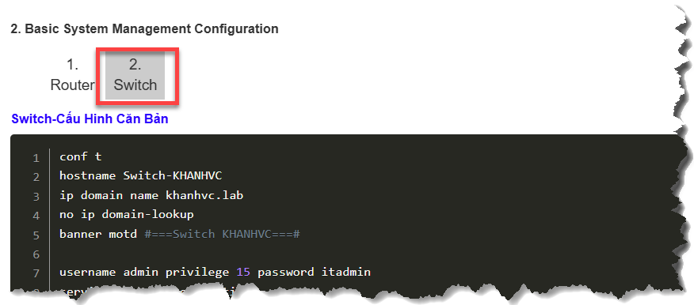

# 
## 0. MỤC TIÊU
- Dùng Power Shell SSH vào thiết bị CISCO IOS
- Đặt thời gian cho thiết bị là thời gian hiện tại, theo giờ Việt Nam (UTC +7)
- Đẩy nội dung cấu hình file vào thiết bị
- Trong hướng dẫn không đề cập đến cấu hình căn bản SSH

## I. CHUẨN BỊ

### 1. Cầu hình căn bản SSH
- Tham khảo tại link *(Mục 2 Switch)* https://khanhvc.blogspot.com/2021/06/cisco-cau-hinh-can-banbasic.html 



### 2. Chuẩn bị file cấu hình: 

Nội dung file `cisco_ios_syslog_hostname.txt`, đảm bảo file này nằm cùng thư mục với file script:
>   - host 192.168.0.111: là địa chỉ **syslog server**
>   - port 1514: là port lắng nghe trên **syslog server**

```bash
conf t

logging origin-id hostname

logging host 192.168.0.111 transport udp port 1514
logging trap informational

service timestamps debug datetime msec show-timezone
service timestamps log datetime msec show-timezone

logging source-interface Vlan1     

logging facility local6         
     
logging buffered 16384 informational  

logging on

end
wri
exit

```

### 3. Cài đặt module Posh-SSH

- Mở PowerShell với quyền Administrator và chạy lệnh:

```powershell
Install-Module -Name Posh-SSH -Force -AllowClobber
```

## II. THỰC HIỆN
### 1. Nội dung file Scripts `cisco_ios_syslog_ssh.ps1`:

```PowerShell
# Nội dung như file đính kèm
Help/II. Log Source (Sender)/99.Scripts/01.Cisco_IOS/cisco_ios_syslog_ssh.ps1
```

### 2. Thực hiện nạp cấu hình vào thiết bị

- Mở file **cisco_ios_syslog_hostname.txt** tìm dòng thứ 5:

```bash
logging host 192.168.0.111 transport udp port 1514
```
Thay đổi IP, Port của syslog Server

- Chạy Windows PowerShell ISE 
    - Chạy bằng Run As Adminitrator
    - Thay IP, user, mật khẩu thành thiết bị cần cấu hình (ở dòng 6, 7, 8)


#### 2.1 Tinh chỉnh cấu hình (nếu cần):

- Đổi hostname thành IP: 
Có 1 số trường hợp đẩy log dưới dạng hostname không phù hợp các bạn có thể mở file .txt tìm `logging origin-id hostname` đôi thành `logging origin-id ip`

- Kết hợp cả hostname và IP:
Cisco không hỗ trợ đẩy đồng thời, nên chúng ta code ghép host_IP bằng 
`logging origin-id String xxx`

> NOTED: Khi thay đổi IP hay hostname sau khi chạy code này thì string không thay đổi theo vì là các xử lý ngoài code để nối chuỗi

    Soạn file `cisco_ios_syslog_ssh_string.ps1` có nội dung:

    ```bash
    # ==============================================================================
    # SCRIPT CẤU HÌNH LOGGING ORIGIN-ID VIA SSH
    # Đăng nhập → Lấy hostname → Thay logging origin-id → Lưu → Thoát
    # ==============================================================================
    $deviceIP   = "192.168.100.9"
    $username   = "admin"
    $password   = "admin"

    Import-Module Posh-SSH

    $secPassword = ConvertTo-SecureString $password -AsPlainText -Force
    $credential  = New-Object System.Management.Automation.PSCredential($username, $secPassword)

    Write-Host ">>> Đang kết nối SSH tới $deviceIP..." -ForegroundColor Cyan

    try {
        $session = New-SSHSession -ComputerName $deviceIP -Credential $credential -AcceptKey -Force
    } catch {
        Write-Error "Lỗi kết nối: $_"
        Exit
    }

    if (-not $session) {
        Write-Error "Không thể kết nối tới $deviceIP"
        Exit
    }

    Write-Host ">>> Kết nối thành công!" -ForegroundColor Green

    # ============================================================
    # BƯỚC 1: Khởi tạo stream — chờ prompt
    # ============================================================
    $stream = New-SSHShellStream -SessionId $session.SessionId

    $banner = ""
    $timeout = 0
    while ($banner -notmatch '[#>]' -and $timeout -lt 5000) {
        Start-Sleep -Milliseconds 500
        $banner += $stream.Read()
        $timeout += 500
    }
    Write-Host "--- Prompt sẵn sàng ---" -ForegroundColor DarkGray

    # ============================================================
    # BƯỚC 2: Lấy hostname
    # ============================================================
    $stream.WriteLine("sh run | inc hostname")
    Start-Sleep -Seconds 2
    $rawResult = $stream.Read()

    Write-Host "--- Raw output ---" -ForegroundColor DarkGray
    Write-Host $rawResult -ForegroundColor DarkGray

    $ciscoHostname = ($rawResult -split "`n" |
        Where-Object { $_ -notmatch "\|" } |
        Where-Object { $_ -notmatch "#" } |
        Where-Object { $_.Trim() -match "hostname\s+\S+" } |
        Select-Object -First 1) -replace ".*hostname\s+", "" `
                                -replace "\r", "" |
        ForEach-Object { $_.Trim() }

    if ([string]::IsNullOrEmpty($ciscoHostname)) {
        Write-Warning "Không lấy được hostname, fallback về IP"
        $ciscoHostname = $deviceIP
    }

    Write-Host ">>> Hostname: $ciscoHostname" -ForegroundColor Yellow

    # ============================================================
    # BƯỚC 3: Thay logging origin-id và lưu
    # ============================================================
    $newOriginId = "logging origin-id string `"${ciscoHostname}_IP_${deviceIP}`""

    Write-Host ">>> Đang cấu hình: $newOriginId" -ForegroundColor Cyan

    $configCmds = @(
        "conf t",
        "no logging origin-id",        # xóa dòng cũ bất kể là gì
        $newOriginId,                  # thêm dòng mới
        "end",
        "wri"
        "exit"
    )

    foreach ($cmd in $configCmds) {
        Write-Host "  >> $cmd" -ForegroundColor Gray
        $stream.WriteLine($cmd)
        Start-Sleep -Milliseconds 500
        $out = $stream.Read()
        if ($out) { Write-Host $out -ForegroundColor DarkGray }
    }

    # ============================================================
    # BƯỚC 4: Cleanup
    # ============================================================
    $stream.Close()
    Remove-SSHSession -SessionId $session.SessionId

    Write-Host ">>> Hoàn thành! Đã cấu hình: $newOriginId" -ForegroundColor Green
    ```


### 3. T-Shoot

- Có 1 số trường hợp session chưa ngắc nên không kết nối được, nên cần phải clear rồi chạy lại
    - Lệnh **show users**
    - Kết quả có dạng
        ```bash
        Khanhvc-lab#show users
            Line       User       Host(s)              Idle       Location
        *  1 vty 0     admin      idle                 00:00:00 192.168.0.46
        2 vty 1     admin      idle                 01:10:53 192.168.0.46
        3 vty 2     admin      idle                 01:22:43 192.168.0.46
 
        Interface    User               Mode         Idle     Peer Address
        ```
    - Xóa băng lệnh clear

        ```bash
        ! ví dụ
        clear line vty 0
        clear line vty 1
        clear line vty 2
        
        ```