# GIÁM SÁT ĐĂNG NHẬP WINDOWS

## 1. Hạ tầng: 
- Graylog Server: 192.168.0.111 (Input Beats Port 5044/TCP).
- Máy Sender (Nguồn Log): 192.168.0.40 (Windows cài Sidecar & Winlogbeat).
- Máy Test (Tác nhân): 192.168.0.46 (Dùng để RDP hoặc kết nối tới máy Sender).

## 2. Cấu hình tại máy Sender (192.168.0.40):
- Bật Advanced Audit Policy (Mục Logon/Logoff).
- Cấu hình YAML chỉ thu thập Event ID **4624 (Thành công)** và **4625 (Thất bại)**.

## 3. Các kịch bản mô phỏng & Tiêu chí phân loại trên Graylog:


* **Nhóm 1: Đăng nhập tại máy**
    * *Thao tác mô phỏng:* Ngồi tại máy `192.168.0.40` để đăng nhập/mở khóa màn hình, hoặc click chuột phải chạy ứng dụng bằng quyền *Run as Administrator*.
    * *Công thức Filter:* `EventID: 4624/4625` **AND** `LogonType: 2` **AND** `SourceIp: 127.0.0.1` (hoặc trống).
    * *Trạng thái:* Đang theo dõi.

* **Nhóm 2: Remote Desktop (RDP)**
    * *Thao tác mô phỏng:* Đứng từ máy `192.168.0.46` mở phần mềm RDP kết nối vào máy `192.168.0.40` (thử nghiệm cả hai trường hợp gõ đúng và gõ sai mật khẩu).
    * *Công thức Filter:* `EventID: 4624/4625` **AND** `LogonType: 10` (hoặc `3` khi dính lỗi NLA) **AND** `SourceIp: 192.168.0.46`.
    * *Trạng thái:* Đang theo dõi.

* **Nhóm 3: RDP Tunneling (Hành vi bất thường)**
    * *Thao tác mô phỏng:* Giả lập kỹ thuật bypass RDP bằng cách tạo một cổng kết nối Tunnel (SSH/Port Forwarding) nội bộ để chiếm quyền từ xa.
    * *Công thức Filter:* `EventID: 4624/4625` **AND** `LogonType: 10` **AND** `SourceIp: 127.0.0.1` (hoặc `::1`).
    * *Trạng thái:* ⚠️ **CẢNH BÁO NGUY HIỂM**.

- Dạng bảng:

| Nhóm hành vi | Thao tác mô phỏng thực tế | Công thức Filter trên Graylog | Trạng thái |
| :--- | :--- | :--- | :--- |
| **Nhóm 1:** Đăng nhập tại máy | Ngồi tại máy `.192.168.0.40` đăng nhập/mở khóa màn hình, hoặc chạy *Run as Admin*. | `EventID: 4624/4625`<br>**+** `LogonType: 2`<br>**+** `SourceIp: 127.0.0.1` (hoặc trống) | Đang theo dõi |
| **Nhóm 2:** Remote Desktop | Từ máy `.192.168.0.46` mở RDP kết nối vào máy `.192.168.0.40` (thử cả gõ đúng/sai pass). | `EventID: 4624/4625`<br>**+** `LogonType: 10` (hoặc `3` khi lỗi NLA)<br>**+** `SourceIp: 192.168.0.46` | Đang theo dõi |
| **Nhóm 3:** RDP Tunneling | Giả lập kỹ thuật bypass RDP qua SSH/Port Forward Tunnel nội bộ. | `EventID: 4624/4625`<br>**+** `LogonType: 10`<br>**+** `SourceIp: 127.0.0.1` (hoặc `::1`) | ⚠️ **CẢNH BÁO** |

## 4. Các Bước Tổng Quan Triển Khai Mô Hình Lab

### **Bước 1: Cấu hình chính sách bảo mật trên máy Windows Source (`192.168.0.40`)**
    * Kích hoạt tính năng ghi log chuyên sâu (Advanced Audit Policy) đối với các hành vi Đăng nhập (Logon) và Đăng xuất (Logoff) để Windows sinh ra các Event ID `4624` và `4625`.

### **Bước 2: Cài đặt và cấu hình tác nhân thu thập (Graylog Sidecar & Winlogbeat)**
    * Thiết lập file `sidecar.yml` trên máy `.40` để kết nối về bộ điều khiển trung tâm của Graylog Server (`192.168.0.111`).

### **Bước 3: Thiết lập cấu hình thu thập tập trung trên giao diện Graylog Web UI**
    * Tạo một Input nhận dữ liệu dạng Beats (Cổng `5044`).
    * Soạn thảo file cấu hình YAML thu hẹp (chỉ lọc lấy đúng Event ID `4624, 4625` thuộc channel `Security`) và gán Tag để tự động đẩy xuống máy `.40`.

### **Bước 4: Viết quy tắc phân loại tự động (Graylog Pipelines)**
    * Xây dựng các đoạn script logic (Rule) trên Graylog Server nhằm tự động bóc tách các trường thông tin: `EventID`, `LogonType`, và `SourceIp`.
    * Dựa vào 3 tổ hợp điều kiện đã định nghĩa ở phần trước để tự động gán nhãn hành vi (`Hanh_Vi: Nhóm 1 / Nhóm 2 / Nhóm 3`).

### **Bước 5: Tạo luồng dữ liệu riêng và thiết kế giao diện theo dõi (Stream & Dashboard)**
    * Điều hướng toàn bộ log đăng nhập đã phân loại vào một Stream bảo mật riêng.
    * Thiết kế các biểu đồ (Widget) trực quan hóa: đếm số ca đăng nhập thành công/thất bại, danh sách IP nguồn (`192.168.0.46`), và kích hoạt chuông cảnh báo (Alert) lập tức nếu xuất hiện hành vi thuộc Nhóm 3.

## 5. Chi tiết triển khai:

### Bước 1: Thực hiện trên Sender (192.168.0.40)
- Mở **secpol.msc** và kích hoạt ghi log trên máy local

```bash
Advanced Audit Policy Configuration -> System Audit Policies - Local Group Policy Object -> Logon/Logoff.
```

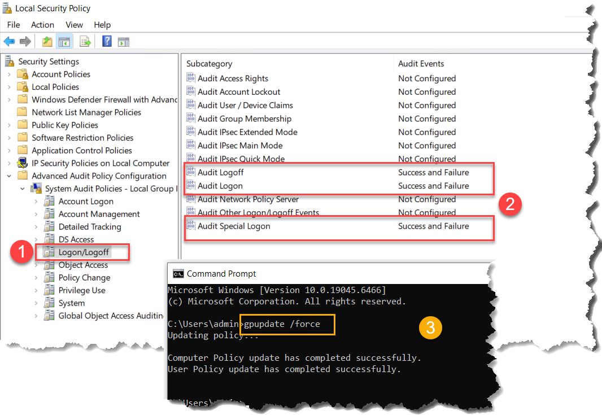

> Ghi chú:
> - Audit Logon: Chịu trách nhiệm sinh ra Event ID 4624 (khi bạn gõ đúng pass đăng nhập thành công) và 4625 (khi gõ sai pass đăng nhập thất bại). Đây là mục cốt lõi nhất.

> - Audit Logoff: Sinh ra Event ID 4634 hoặc 4647 khi người dùng thoát phiên (để bạn theo dõi thời gian họ vào/ra).

> - Audit Special Logon: Sinh ra Event ID 4964 hoặc hỗ trợ ghi nhận khi một tài khoản đặc biệt (như Administrator) đăng nhập và kích hoạt quyền tối cao (giúp ích cho kịch bản chạy Run as Admin ở Nhóm 1).

### Bước 2: Graylog Server

#### 2.1 Tạo API Token trên Graylog Server (192.168.0.111)

- System -> Sidecars -> Create or reuse a token for the sidecar status report -> <Nhập tên> -> Create -> copy

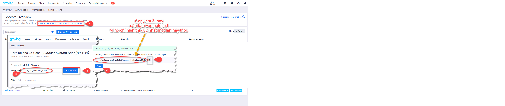

> Tokens
>  - 6sfc2lme3pr1d4srufhva5e6t8fpk3lkulgh4a30phnond2ir9s


#### 2.2: Cấu hình dưới máy Sender Windows (192.168.0.40)

- 1. Tải và cài đặt `Graylog Sidecar`

    * https://github.com/graylog2/collector-sidecar/releases

        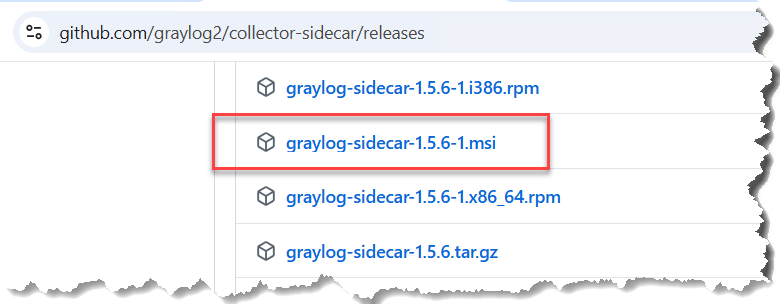

    * Thư mục cài đặt mặc định sẽ nằm tại: `C:\Program Files\Graylog\sidecar`

- 2. Cấu hình file `sidecar.yml`

    * Dùng nodepad để edit file `sidecar.yml` *(Nếu file không tồn tại có thể clone file sidecar-example.yml)*
    
    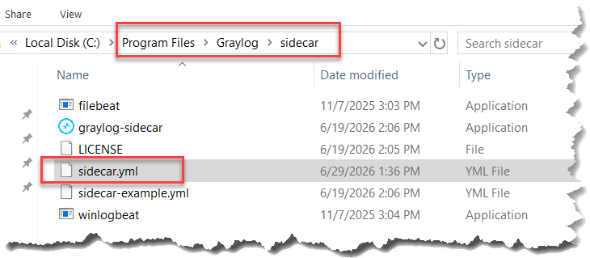


    > Chú ý:
    > - Tìm sửa 4 mục như dưới là: Ai gửi cho ai, có được quyền gửi không và tabs là gì

    ```bash
    server_url: "http://192.168.0.111:9000/api/"

    server_api_token: "dán_token_bạn_tạo_trên_web_graylog_vào_đây - Bước 2.1"

    node_name: "vck_Windows-Lab-Source"

    tags:
    - vck_windows

    ```

    - Khởi động services Graylod Sidecar

    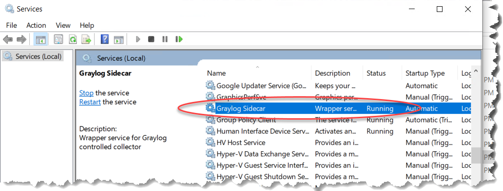

    - Xem trên Graylog Server (Nếu thấy là kết nối thành công)

    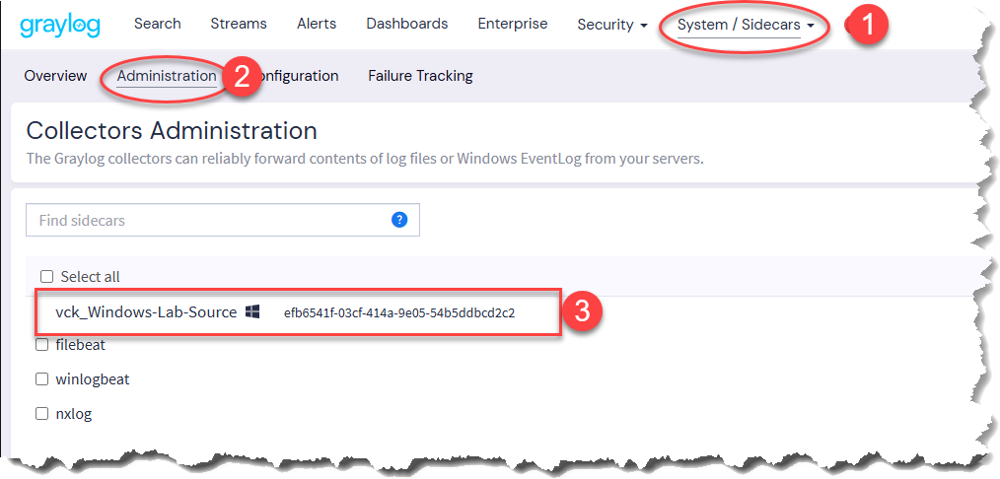

### Bước 3: Thực hiện trên Graylog Server_192.168.0.111

Tạo Input và cấu hình file Winlogbeat

#### 3.1 Tạo cổng hứng log (Beats Input)
- System -> Inputs -> Beats -> Launch new input

- Điền thông tin cơ bản:
    * **Tible**: vck_Windows-Beats
    * **Bind Address**: 0.0.0.0
    * **Port**: 5044

    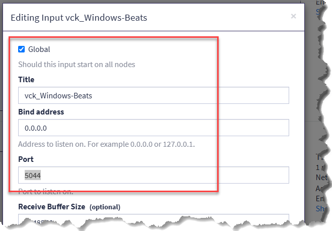

- Save -> đảm bảo RUNNING (màu xanh)

    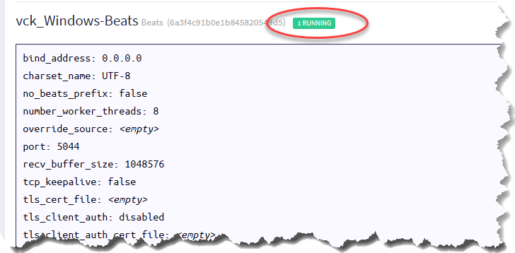

#### 3.2: Soạn cấu hình Winlogbeat và gán Tag

- 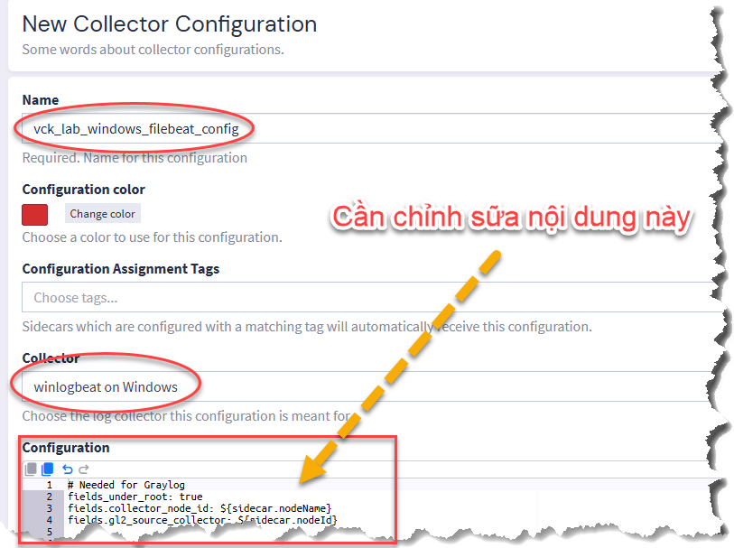

- Nội dung file cấu hình:

    ```YAML
    # Needed for Graylog
    fields_under_root: true
    fields.collector_node_id: ${sidecar.nodeName}
    fields.gl2_source_collector: ${sidecar.nodeId}


    output.logstash:
    hosts: ["192.168.0.111:5044"]
    
    path:
    data: ${sidecar.spoolDir!"C:\\Program Files\\Graylog\\sidecar\\cache\\winlogbeat"}\data
    logs: ${sidecar.spoolDir!"C:\\Program Files\\Graylog\\sidecar"}\logs

    tags:
    - vck_windows
    
    winlogbeat:
    event_logs:
    - name: Security
        # chỉ nhận các Event  ID được liệt kê
        event_id: 4624, 4625
    
    ```
> Ghi chú:
- Có 1 số trường hợp port 5044 chưa allow trên Server Graylog cần phải kiểm tra
- [Hướng dẫn check port 5044](<../../I. Graylog Server/101. Sidecar-Windows/Huong_dan_check_port 5044.md>)

#### 3.3 Assign Configuations (Gán) cấu hình cho Host

System -> Sidecars -> Administration -> chọn host cần gán (`vck_Windows-Lab-Source`) -> Assign Configuations -> chọn Collectors **Configuration** `vck_lab_windows_beatfile_config`

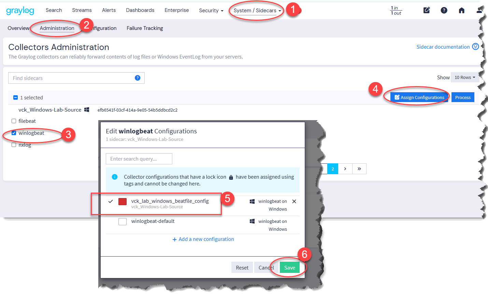

Đảm bảo RUNNING

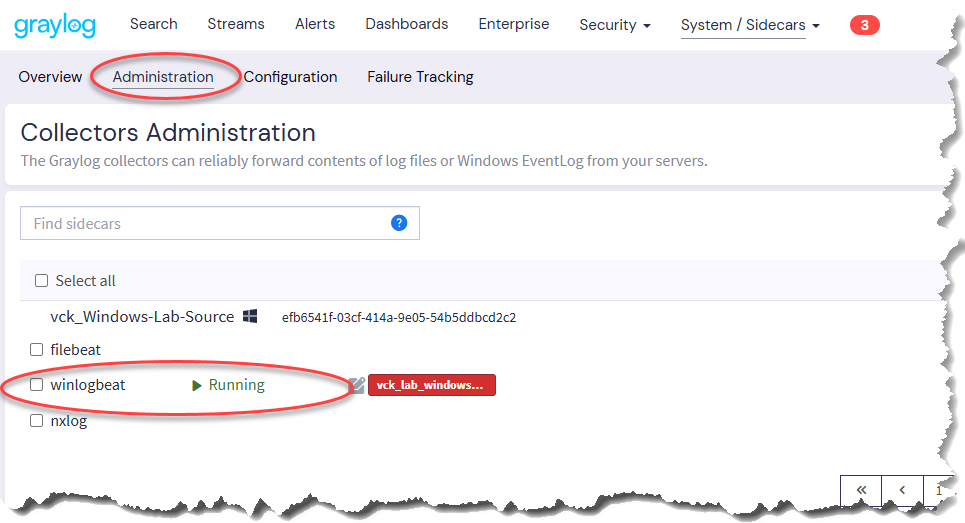

### Bước 4: 

#### 4.1 Tạo Streams

- Tạo mới Streams

Streams -> Create stream -> Điền thông tên -> tích chọn **Remove matches from ‘Default Stream’** -> Create stream 

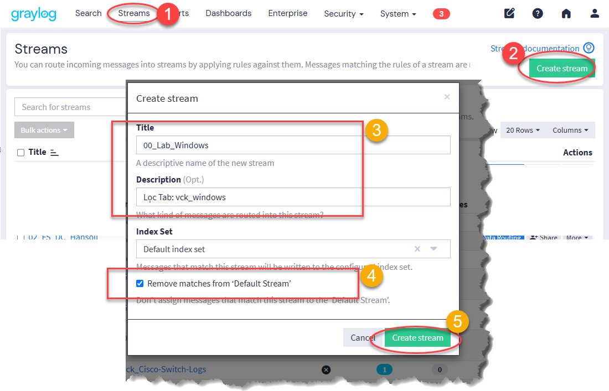

- Làm Rule để lọc
More -> Manager Rules

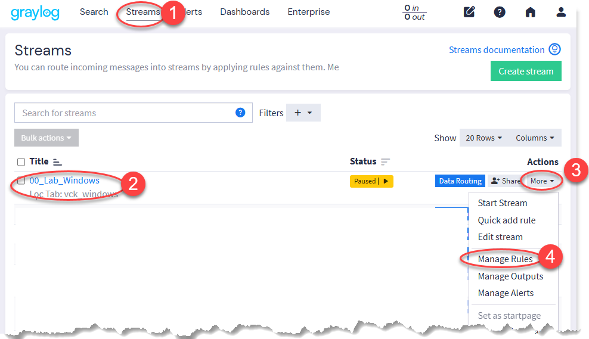

- Chọn **winlogbeat_tags** và **vck_windows** là tabs đã cấu hình trước đó

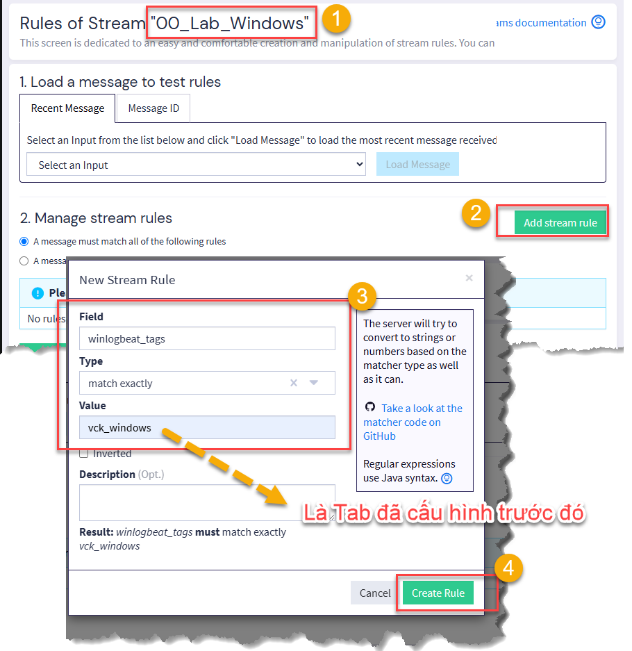

- Kết quả có dạng

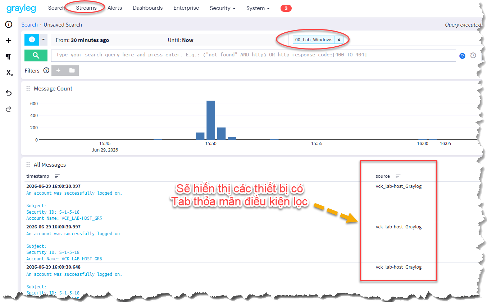

#### 4.2