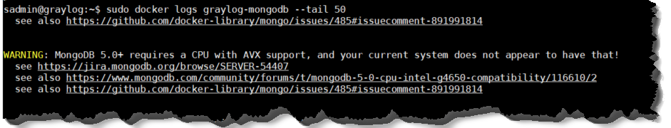

#

## Cấu hình đẩy log về Server
### Cisco IOS
```bash
conf t

logging on
logging host 192.168.0.61 transport udp port 1514
logging trap informational

service timestamps debug datetime msec show-timezone
service timestamps log datetime msec show-timezone

logging source-interface Vlan1     
! # gắn facility rõ ràng, dễ filter  
logging facility local6         
! # buffer log local phòng khi mất kết nối      
logging buffered 16384 informational  

end
wri

```

#### Kiểm tra thông tin đã cấu hình
```bash
! Trên Cisco — xem log đang gửi không
show logging | include 192.168.0.61
show logging | include trap

```

#### Cài đặt giờ

```bash
conf t
clock timezone UTC +7 0
!
ip domain-lookup
! ip name-server 8.8.8.8
ip name-server 192.168.99.11

! ntp server time.google.com   <= cập nhật ngày giờ bằng tên miền
ntp server time.hansollvina.com
ntp server 192.168.99.10
end
wri

```

#### Kiểm tra giờ đúng chưa
```bash
show clock
```


## FIX lỗi

```bash
# cập nhật ip
sudo graylog-update-ip


cd /opt/graylog
sudo docker compose down
sudo docker compose up -d
sudo docker compose ps

# tìm ten container
docker ps -a | grep graylog


# 
docker logs <graylog_container_name tim duoc> --tail 50


## kiểm tra file .env
sudo nano /opt/graylog/.env

# Nếu có thay đổi restart Graylog
cd /opt/graylog && sudo docker compose up -d graylog

== xoa file log
sudo rm -f /data/graylog/mongodb/mongod.lock
sudo rm -f /data/graylog/mongodb/WiredTiger.lock

# Xem lỗi
sudo docker logs graylog-mongodb --tail 50

